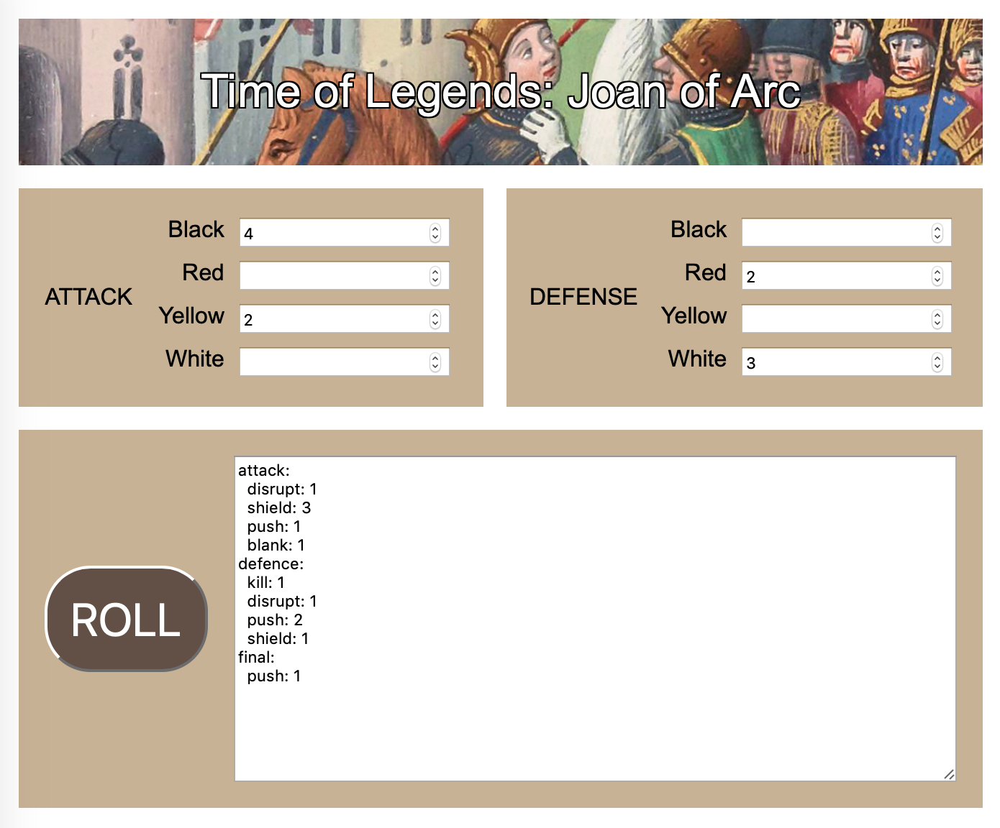

# JoA Dices

a library, a CLI and a webapp for dice rolls in [Time of Legends: Joan of Arc](https://www.mythicgames.net/en/time-of-legends-joan-of-arc/)

I'm also using that project as a use-case for exploring dev in other languages
- [Typescript](https://github.com/ycardon/joa-dices) (original)
- [Rescript](https://github.com/ycardon/joa-dices-rescript)
- [Haskell](https://github.com/ycardon/joa-dices-haskell)
- [Rust](https://github.com/ycardon/joa-dices-rust)

## install

```
npm install -g joa-dice
```

## usage


```
joa-dice <attack dices> [: <defense dices>]
```

where `<attack dices>` and `<defence dices>` are
- `nN` n black combat dices
- `nR` n red combat dices
- `nJ` n yellow combat dices
- `nB` n white combat dices
- `nG` n gigantic combat dices
- `nD` n doom dices

for example:

- `joa-dice 2R` is 2 red dices in attack

- `joa-dice 2R 1J : 2N` is 2 red and 1 yellow dices in attack vs 2 black dices in defence, in that case the CLI is also calculating the net attack score by substracting defence shields

## webapp


